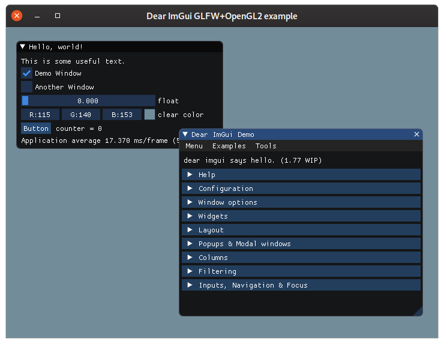

## Introduction

Minimal ImGUI demos are based on examples from the ImGui project.
There are two examples for OpenGL 2.0 & 3.0.



The project includes the following dependencies:

* [imgui](https://github.com/ocornut/imgui) - Minimal GUI.
* [glfw](https://github.com/glfw/glfw) - Windowing and Input.
* [glad](https://github.com/Dav1dde/glad) - OpenGL Function Loader.

## Using ImGui in a CMake Project 

To use the ImGui in a CMake project one should copy the following files:

* `3rdparty/imgui` - directory with ImGui headers copied from the original repository. This is a git submodule in this repository.
* `cmake/imgui.cmake` - CMake module that defines variables `IMGUI_LIBRARIES` and `IMGUI_INCLUDE_DIR`.

## Environment Setup

### Debian-based Systems

The following instructions apply to:

* Ubuntu 24.04, 22.04, 20.04
* Debian 12, 11

```
sudo apt-get install -y \
    build-essential \
    cmake \
    xorg-dev \
    libgl1-mesa-dev \
    libfreetype6-dev
```

### RedHat-based Systems

The following instructions apply to:

* Fedora 22 and higher

```
sudo dnf install -y \
    gcc gcc-c++ make \
    cmake \
    mesa-libGL-devel \
    libXrandr-devel \
    libXinerama-devel \
    libXcursor-devel \
    libXi-devel \
    freetype-devel
```

## Building

Check out sources with `--recursive` parameter for 3rd-party libraries:

```
git clone --recursive https://github.com/Postrediori/MinimalImGui.git
```

Prepare build with CMake and build executables

```
mkdir build && cd build
cmake .. -DCMAKE_BUILD_TYPE=Release
make
make install
```

## Running

Using `make install` will copy the executable to `bundle` directory:

```
cd bundle

# Example with OpenGL 2.0:
./bundle/MinimalImGuiOpenGl2

# Example with OpenGL 3.0:
./bundle/MinimalImGuiOpenGl3
```

## TODO
* Include ImGui module as git submodule (like glfw and glad).
* Autogeneration of ImGui headers using [cimgui](https://github.com/cimgui/cimgui).
